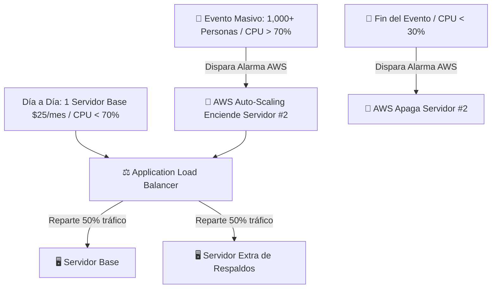

# 🔄 Guía de Auto-Escalado Elástico por Hora en AWS (Pay-per-Hour Auto-Scaling)

Esta guía explica cómo configurar el **Auto-Escalado por Demanda en AWS (Auto Scaling Group / ECS)** para la plataforma **Daily Lover**. 

Con esta configuración:
1. **Día a día (Modo Normal)**: Pagas solo **1 servidor económico** ($20–$30/mes).
2. **Durante un Evento Masivo**: Si el uso de CPU supera el **70%**, AWS enciende automáticamente **1 o 2 servidores extra** en segundos.
3. **Al finalizar el Evento**: Cuando el uso de CPU vuelve a bajar del **30%**, AWS apaga automáticamente los servidores extra.
4. **Costo Real del Servidor Extra**: Pagarás solo las 2 o 3 horas que dura el evento (aproximadamente **$0.30 a $0.50 USD por evento**).

---

## 🏗️ Cómo Funciona el Auto-Escalado en AWS



---

## ⚡ Configuración de la Regla de Auto-Escalado (70% CPU)

### Métrica de Disparo (Target Tracking Policy)
- **Métrica Objetivo**: Utilización promedio de CPU (`CPUUtilization`).
- **Valor Umbral**: `70%`.
- **Tiempo de Espera para Escalar (Scale Out)**: 60 segundos (Rápido para no colgar la app).
- **Tiempo de Espera para Enfriar (Scale In)**: 300 segundos (5 minutos para evitar encender y apagar a cada instante).

---

## 🛠️ Opción A — Configuración Fácil en AWS EC2 (Auto Scaling Group)

### Paso 1: Crear una "Plantilla de Lanzamiento" (Launch Template)
1. Ve a la consola de **AWS EC2** -> **Launch Templates** -> Clic en **Create launch template**.
2. Nombre: `dailylover-app-template`.
3. AMI: **Ubuntu 22.04 LTS**.
4. Instance Type: `t4g.large` (ARM Graviton3) o `t3.large`.
5. Key pair: Selecciona tu llave SSH de AWS.
6. En **User Data** (al final de la página), pega este script para que el nuevo servidor se autoinstale al encender:

```bash
#!/bin/bash
cd /home/ubuntu
git clone https://github.com/Miguel1721/dailylover-app.git dailylover
cd dailylover
cp .env.example .env
docker compose up -d --build
```

---

### Paso 2: Crear el Grupo de Auto-Escalado (Auto Scaling Group)
1. Ve a **EC2** -> **Auto Scaling Groups** -> Clic en **Create Auto Scaling group**.
2. Nombre: `asg-dailylover`.
3. Selecciona la plantilla `dailylover-app-template`.
4. Define las capacidades de servidores:
   - **Minimum capacity** (Mínimo): `1` (Servidor normal).
   - **Desired capacity** (Deseado): `1`.
   - **Maximum capacity** (Máximo): `4` (Límite en eventos gigantes).

---

### Paso 3: Configurar la Regla del 70% CPU
1. En el paso **Automatic scaling**, elige **Target tracking scaling policy**.
2. Metric type: **Average CPU utilization**.
3. Target value: `70`.
4. Instance warmup: `60` seconds.

---

## 🛠️ Opción B — Configuración Avanzada con AWS ECS Fargate (Sin administrar Linux)

Si usas **AWS ECS Fargate** (Contenedores Serverless):
1. No pagas por servidores virtuales EC2; pagas por segundo exacto de uso del contenedor Docker.
2. Configuras el Service Auto Scaling en ECS:
   - Target Metric: `ECSServiceAverageCPUUtilization` = `70%`.
   - Min tasks: `1`.
   - Max tasks: `5`.

---

## 💰 Cálculo del Costo por Evento

Ejemplo de costo en un evento de viernes en la noche (Duración: 4 horas):

- **Servidor Base (24/7)**: Ya pagado en la tarifa normal ($25/mes).
- **Servidor Extra de Respaldos (`t4g.large` a $0.0672 / hora)**:
  - 4 horas × $0.0672 = **$0.26 USD**.
- **Costo Total del Evento**: **26 centavos de dólar ($0.26 USD)**.

Al terminar el evento a la medianoche, AWS elimina el servidor extra automáticamente y tu factura vuelve al costo base.
