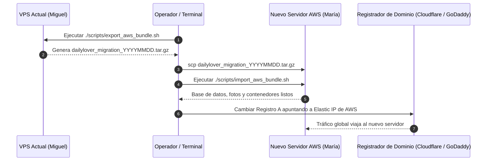

# ☁️ Guía Ejecutiva de Migración a Servidores Propios de AWS — Daily Lover

Esta guía describe el procedimiento exacto para migrar la plataforma **Daily Lover** desde el servidor actual hacia la infraestructura propia de **AWS de María Paula**, de forma limpia, en menos de **15 minutos**, con **cero pérdida de datos** y soporte para dominios propios oficiales (ej. `app.dailylover.com` o `admin.dailylover.co`).

---

## 1. 💵 Especificaciones Técnicas y Costo Estimado en AWS

Para alojar la base de datos (PostgreSQL 16 + pgvector), el backend FastAPI, Celery, Redis y el panel administrativo con soporte para los más de **4.700 clientes y picos de 1.000 usuarios en eventos**:

| Recurso AWS | Tipo / Configuración | Especificaciones | Costo Aprox. Mensual |
| :--- | :--- | :--- | :--- |
| **Instancia EC2 (Recomendada)** | `t4g.xlarge` (ARM Graviton3) | 4 vCPU, 16 GB RAM | **~$28 - $35 USD / mes** |
| **Almacenamiento EBS** | `gp3` (General Purpose SSD) | 50 GB (3.000 IOPS, 125 MB/s) | **~$4.00 USD / mes** |
| **IP Elástica (Elastic IP)** | 1 Dirección IPv4 fija | Asociada a la instancia | **$0.00** (incluida mientras la instancia esté encendida) |
| **Certificados SSL** | Let's Encrypt (Automático) | TLS 1.3 con renovación automática | **$0.00** (Gratuito) |
| **Costo Total Estimado** | — | — | **~$32 - $39 USD / mes** |

---

## 2. 🛡️ Configuración de Seguridad en AWS (Security Group)

Al crear la instancia en la consola de AWS, configurar el grupo de seguridad con **únicamente 3 puertos abiertos al exterior**:

| Tipo de Tráfico | Puerto | Protocolo | Origen / CIDR | Propósito |
| :--- | :---: | :---: | :--- | :--- |
| **SSH** | `22` | TCP | `Tu IP fija` (o restringido) | Conexión administrativa segura |
| **HTTP** | `80` | TCP | `0.0.0.0/0` | Redirección automática a HTTPS |
| **HTTPS** | `443` | TCP | `0.0.0.0/0` | Tráfico web cifrado SSL |

> [!CAUTION]
> **Nunca abrir los puertos 5432 (Postgres), 6379 (Redis), 3030 (Metabase) ni 9090 (Portainer) en el Security Group de AWS**. Toda la comunicación entre la base de datos y la API corre de forma 100% aislada a través de la red interna Docker `dl_network`.

---

## 3. ⚡ Procedimiento de Migración en 5 Pasos (Zero-Downtime)



### Paso 1: Generar el Paquete de Migración en el Servidor Actual
Conéctate al servidor actual y corre el script automatizado:
```bash
cd /home/ubuntu/dailylover
chmod +x scripts/export_aws_bundle.sh
./scripts/export_aws_bundle.sh
```
*Salida:* Genera el archivo `/home/ubuntu/dailylover_migration_YYYYMMDD_HHMMSS.tar.gz` que contiene la base de datos completa con pgvector, las fotos de clientes y las configuraciones.

---

### Paso 2: Transferir el Paquete al Nuevo Servidor AWS
Desde tu computadora local, transfiere el archivo directamente al servidor de María:
```bash
scp -i "llave_maria_aws.pem" \
    /home/ubuntu/dailylover_migration_*.tar.gz \
    ubuntu@<IP_ELASTICA_AWS>:/home/ubuntu/
```

---

### Paso 3: Ejecutar la Restauración en AWS
Conéctate al nuevo servidor AWS y lanza el importador en 1 solo paso:
```bash
ssh -i "llave_maria_aws.pem" ubuntu@<IP_ELASTICA_AWS>

# Descargar el script de importación o usar el incluido
chmod +x import_aws_bundle.sh
./import_aws_bundle.sh dailylover_migration_*.tar.gz
```
*El script se encarga de:*
- Instalar Docker Engine y Docker Compose si no existen.
- Levantar PostgreSQL con extensión `pgvector`.
- Inyectar el dump completo con perfiles, matches, notas y vectores.
- Restaurar las imágenes y fotos de los clientes.
- Levantar el proxy Traefik con SSL y los contenedores de FastAPI y Celery.

---

### Paso 4: Redireccionar el Dominio Oficial (DNS Cutover)
En el panel de DNS de Daily Lover (Cloudflare, GoDaddy, Namecheap o Route 53):
- Cambiar el **Registro A** de `app.dailylover.com` o `admin.dailylover.com` para que apunte a la **IP Elástica de AWS**.
- El proxy Traefik en el nuevo servidor generará automáticamente los certificados SSL de Let's Encrypt en cuestión de segundos.

---

### Paso 5: Verificación y Check de Salud
Ejecutar en el servidor AWS:
```bash
docker compose ps
curl -I https://<TU_DOMINIO_OFICIAL>/api/v1/config
```
Verificar que la respuesta sea `HTTP/2 200 OK` y que María Paula pueda ingresar al panel con sus credenciales habituales.
