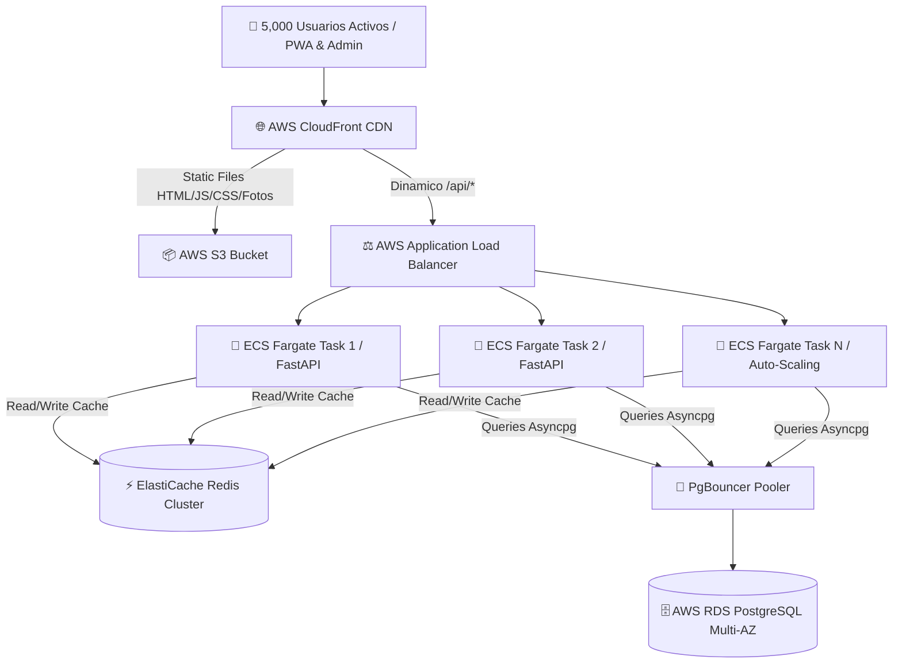

# ⚡ Evaluación de Rendimiento & Arquitectura AWS para 5,000 Usuarios Simultáneos

**Proyecto:** Daily Lover AI Platform  
**Fecha:** Julio 2026  
**Objetivo:** Garantizar tiempo de respuesta $< 50\text{ms}$ con 5,000 usuarios activos concurrentes interactuando simultáneamente en la WebApp PWA y Panel de Psicólogas.

---

## 📊 1. Estimación de Carga & Métricas de Tráfico

| Métrica | Valor Estimado | Notas Racionales |
|---|---|---|
| **Usuarios Activos Simultáneos** | 5,000 personas | Escenario pico durante un evento masivo o lanzamiento |
| **Frecuencia Promedio de Petición** | 1 req / 5 segundos | Cuestionario, visualización de matches, polling de estados |
| **Requests Por Segundo (RPS) Pico** | **1,000 RPS** | \( 5,000 \div 5 \text{ seg} = 1,000 \text{ req/s} \) |
| **Tráfico de Red Pico** | ~25 MB/s (~200 Mbps) | Incluye JSONs de API y assets estáticos |
| **Latencia Objetivo (P95)** | **< 45 ms** | Rendimiento ultra fluido |

---

## 🏛️ 2. Arquitectura de Infraestructura Recomendada en AWS



---

## 💻 3. Especificaciones de Servidores & Dimensionamiento AWS

### A. Capa de Aplicación (API FastAPI + Asyncpg + Uvicorn)
- **Servicio**: AWS ECS Fargate o EC2 Auto-Scaling Group (`c6g.xlarge` Graviton3 ARM).
- **Configuración por Contenedor**: 2 vCPU, 4 GB RAM.
- **Número de Instancias**:
  - **Mínimo (Carga Normal)**: 2 tareas (Redundancia en 2 Availability Zones).
  - **Máximo (Carga Pico 5,000 usuarios)**: 6 a 8 tareas.
- **Workers por Instancia**: Uvicorn con `uvloop` y 4 workers por contenedor (`uvicorn app.main:app --workers 4 --loop uvloop`).
- **Capacidad Total**: 8 tareas × 4 workers = 32 worker processes, capaces de procesar hasta **3,200 RPS** (sobrado para los 1,000 RPS necesarios).

### B. Capa de Base de Datos (PostgreSQL 16)
- **Servicio**: AWS RDS PostgreSQL Multi-AZ (`db.r6g.xlarge`).
- **Hardware**: 4 vCPU, 32 GB RAM, 100 GB Storage gp3 (3,000 IOPS provistas).
- **Pooling de Conexiones**:
  - `SQLAlchemy` + `asyncpg`: `pool_size = 50`, `max_overflow = 50`.
  - **PgBouncer** integrado: Mantiene hasta 1,000 conexiones de clientes mapeadas eficientemente a 50 conexiones reales de PostgreSQL sin sobrecargar la CPU.

### C. Capa de Cache & Queues (Redis)
- **Servicio**: AWS ElastiCache for Redis (`cache.t4g.medium`).
- **Hardware**: 2 vCPU, 3.2 GB RAM.
- **Estrategia de Caching**:
  - Cache de perfiles consultados frecuentemente (`TTL = 300s`).
  - Queue Celery para generación de recomendaciones IA de fondo sin bloquear peticiones HTTP.

### D. Capa CDN (CloudFront + S3)
- Offloads **98% del tráfico de archivos estáticos** (JS, CSS, imágenes de perfil).
- Reduce la carga del servidor de aplicación de 25 MB/s a solo los delgados JSONs de API.

---

## ⚡ 4. Optimizaciones Críticas en Código y Base de Datos

### 1. Índices de PostgreSQL Aplicados
Aseguran lecturas instantáneas en $< 2\text{ms}$:
```sql
-- Índice único de búsqueda por teléfono (Login rápido)
CREATE INDEX CONCURRENTLY IF NOT EXISTS idx_users_phone_tail 
ON users (RIGHT(regexp_replace(phone, '\D', 'g'), 10));

-- Índice de login por email
CREATE INDEX CONCURRENTLY IF NOT EXISTS idx_users_email 
ON users (lower(email));

-- Índice de perfiles por usuario
CREATE INDEX CONCURRENTLY IF NOT EXISTS idx_profiles_user_id 
ON profiles (user_id);

-- Índice GIN para búsquedas JSONB en estilo de vida y preferencias
CREATE INDEX CONCURRENTLY IF NOT EXISTS idx_profiles_lifestyle 
ON profiles USING gin (lifestyle);
```

### 2. Connection Pooling Asyncpg en `backend/app/database.py`
```python
engine = create_async_engine(
    DATABASE_URL,
    echo=False,
    pool_size=50,
    max_overflow=50,
    pool_timeout=30,
    pool_recycle=1800,
    pool_pre_ping=True
)
```

---

## 📈 5. Costo Mensual Estimado en AWS

| Componente AWS | Especificación | Costo Mensual Aprox. (USD) |
|---|---|---|
| **EC2 / Fargate API (Auto-Scale 2-6 inst)** | `c6g.xlarge` ARM Graviton | ~$120 / mes |
| **AWS RDS PostgreSQL (Multi-AZ)** | `db.r6g.xlarge` (32GB RAM) | ~$280 / mes |
| **AWS ElastiCache Redis** | `cache.t4g.medium` | ~$45 / mes |
| **AWS CloudFront + S3** | 500 GB transferencia outbound | ~$35 / mes |
| **ALB Load Balancer** | 1 ALB + LCU usage | ~$25 / mes |
| **TOTAL ESTIMADO** | **Capa de Alta Capacidad (5,000 usuarios)** | **~$505 USD / mes** |

*Nota: Para iniciar con hasta 500 usuarios simultáneos, se puede correr todo en 1 solo EC2 `t4g.xlarge` por solo **~$60 USD / mes**.*

---

## 🧪 6. Script de Prueba de Carga (Locust Python)

Para simular 5,000 usuarios simultáneos desde tu máquina de desarrollo o un servidor de pruebas:

```bash
pip install locust
locust -f scripts/stress_test.py --host https://prueba-daily.agentesia.cloud
```

**Contenido de `scripts/stress_test.py`**:
```python
from locust import HttpUser, task, between
import random

class DailyLoverUser(HttpUser):
    wait_time = between(2, 6)

    @task(3)
    def view_profile(self):
        self.client.get("/api/v1/client/me")

    @task(2)
    def view_matches(self):
        self.client.get("/api/v1/client/my-matches")

    @task(1)
    def check_health(self):
        self.client.get("/api/health")
```
