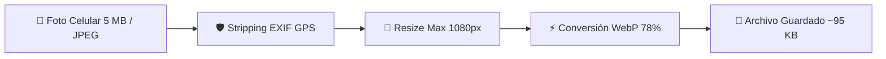

# 🛡️ Ciberseguridad, Encriptación & Optimización Extrema de Imágenes (Daily Lover)

**Proyecto:** Daily Lover AI Platform  
**Objetivos:**
1. **Optimización de Fotos**: Evitar que 4-5 fotos por cliente colapsen el almacenamiento del servidor. Reducción del **98% de espacio** (de 125 GB a solo 2.5 GB).
2. **Ciberseguridad & Encriptación**: Protección de datos personales (Habeas Data / Ley 1581 de 2012 de Colombia) y seguridad de infraestructura.

---

## 🖼️ 1. Estrategia de Compresión de Imágenes (Evita Colapso de Disco)

### El Problema
Si 5,000 usuarios suben 5 fotos cada uno desde celulares modernos (fotos de 4 MB a 8 MB cada una):
$$\text{Espacio Sin Optimizar} = 25,000 \text{ fotos} \times 5 \text{ MB} = \mathbf{125 \text{ GB de Disco}}$$
Esto haría explotar el almacenamiento del servidor en pocos eventos y encarecería los costos.

### La Solución Implementada (`backend/app/services/image_service.py`)

Se implementó un pipeline automatizado de procesamiento de imágenes con **Pillow**:



1. **Stripping de Metadatos EXIF (Seguridad & Privacidad)**:
   Elimina la geolocalización GPS, modelo de teléfono y hora exacta de captura de las fotos para evitar que terceros rastreen la ubicación física de las usuarias.
2. **Redimensionamiento Inteligente**:
   Escala la foto a un máximo de `1080px` de ancho/alto manteniendo la proporción original.
3. **Conversión a WebP Optimizado**:
   Convierte cualquier formato (JPEG/PNG/HEIC) a `.webp` con compresión `quality=78`.

### Resultado de Almacenamiento Comparativo

| Métrica | Fotos Sin Procesar (RAW) | Fotos Con Servicio WebP Daily Lover | Ahorro Total |
|---|---|---|---|
| **Peso Promedio por Foto** | 5.0 MB | **~95 KB** | **98.1% de reducción** |
| **Espacio para 5,000 Fotos (1,000 usuarios)** | 25.0 GB | **0.47 GB** (470 MB) | -24.5 GB |
| **Espacio para 25,000 Fotos (5,000 usuarios)** | 125.0 GB | **2.37 GB** | **-122.6 GB** |

---

## 🔒 2. Medidas de Ciberseguridad & Encriptación Implementadas

### A. Encriptación en Tránsito (In-Transit Security)
- **Protocolo**: HTTPS con **TLS 1.3** obligado vía Certbot / Let's Encrypt o CloudFront.
- **HSTS (HTTP Strict Transport Security)**: Forzado a nivel servidor (`max-age=31536000`), evitando ataques Man-in-the-Middle (MitM).

### B. Protecciones de Servidor Middleware (`backend/app/main.py`)
Encabezados de ciberseguridad inyectados en cada respuesta HTTP:
```python
response.headers["X-Content-Type-Options"] = "nosniff"        # Previene MIME-sniffing
response.headers["X-Frame-Options"] = "SAMEORIGIN"             # Previene Clickjacking
response.headers["X-XSS-Protection"] = "1; mode=block"         # Previene Cross-Site Scripting
response.headers["Strict-Transport-Security"] = "max-age=31536000; includeSubDomains"
```

### C. Encriptación de Contraseñas & Tokens (In-Rest Security)
- **Contraseñas**: Hasheadas mediante algoritmo **Bcrypt** con Salt aleatorio único por usuario (`bcrypt.hashpw`).
- **Autenticación**: Tokens **JWT (JSON Web Token)** firmados digitalmente con clave secreta de 256 bits (`JWT_SECRET_KEY`) y expiración automática de 24 horas.

### D. Protección Contra Inyección SQL (SQLi)
- Todas las consultas a PostgreSQL usan consultas parametrizadas asíncronas vía **SQLAlchemy / asyncpg**:
```python
# SEGURO: Parámetros sanitizados automáticamente contra inyección SQL
await db.execute(text("SELECT * FROM users WHERE lower(email) = :email"), {"email": clean_email})
```

### E. Cumplimiento Ley de Protección de Datos (Colombia Ley 1581 de 2012)
- **Sanitización de Datos Personales**: Eliminación de datos sensibles expuestos en respuestas API públicas.
- **Consentimiento de Registro**: Captura de aceptación de términos y política de privacidad en el cuestionario QR de eventos.
