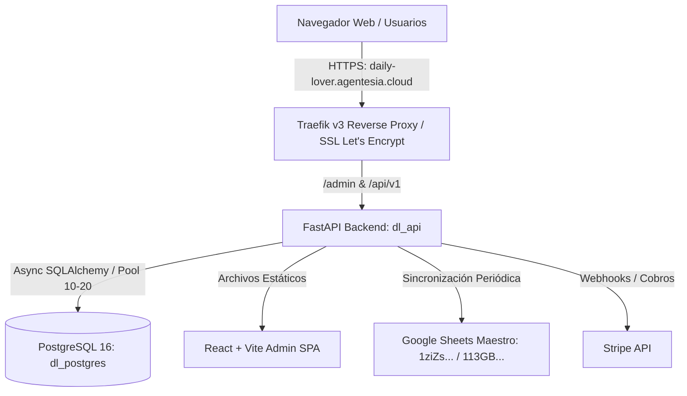
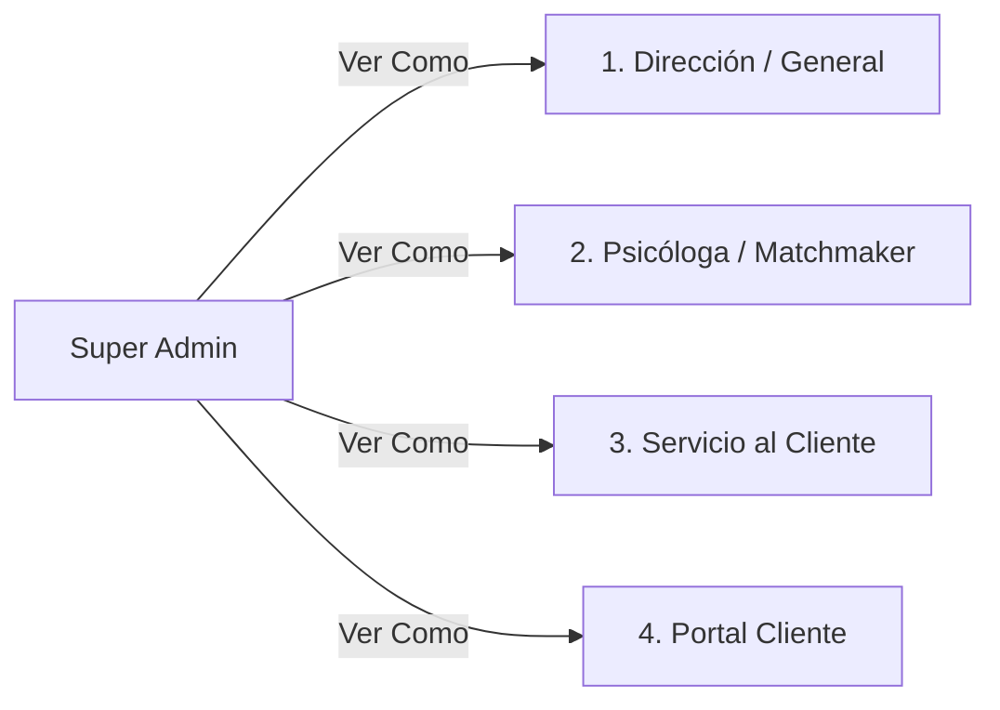
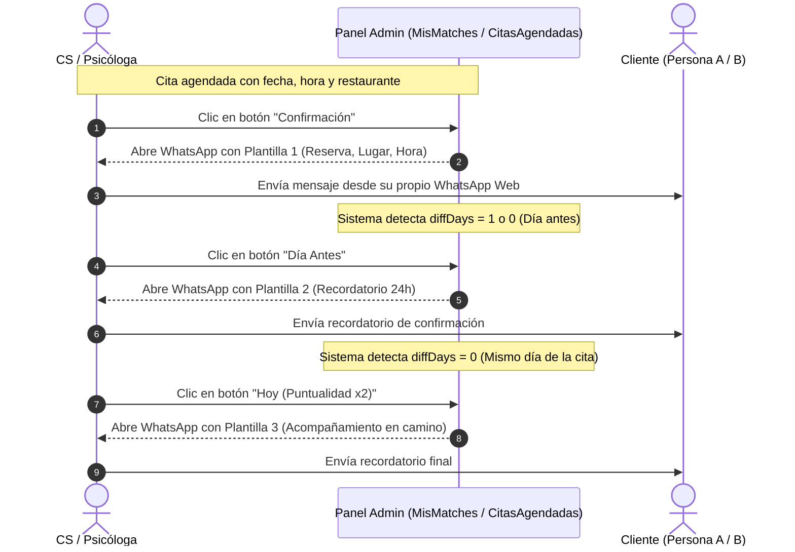
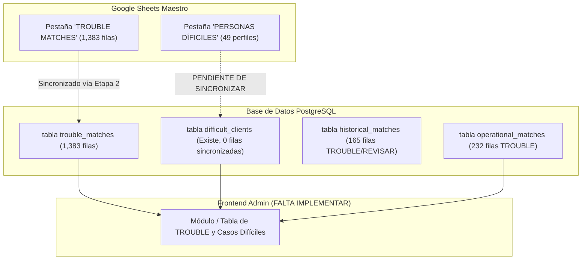

# DAILY LOVER: AUDITORÍA INTEGRAL DEL SISTEMA, FLUJO REAL Y GESTIÓN DE TROUBLE

**Versión:** 2.0 (SSOT Permanente)  
**Fecha de Auditoría:** Septiembre 2026  
**Entorno de Producción:** `https://daily-lover.agentesia.cloud`  
**Servidor VPS:** `149.130.162.11` (Jump Host: `157.137.232.7`)  
**Base de Datos:** PostgreSQL `dailylover` (`dl_postgres`)  

---

## 1. RESUMEN EJECUTIVO Y PROPÓSITO DE ESTE DOCUMENTO

Este documento constituye la **Fuente Única de Verdad (SSOT)** del sistema Daily Lover. Su objetivo es registrar con total fidelidad técnica y operativa el funcionamiento del software, preservando el contexto ante cualquier reinicio de sesión o memoria de IA, y resolviendo la brecha detectada en la gestión de casos **TROUBLE** y **PERSONAS DIFÍCILES**.

> [!IMPORTANT]
> **Aclaración Clave sobre el Flujo Operativo Actual:**
> 1. **Mensajería WhatsApp ($0 Meta):** Ya está implementada de forma no automática en el frontend mediante enlaces directos `wa.me/57...` y modales con las 3 plantillas canónicas (Confirmación, Día Antes, Hoy). No se utiliza la API oficial de WhatsApp para no incurrir en costos por conversación.
> 2. **Panel de Citas Aceptadas:** Ya está implementado en `CitasAgendadas.jsx` (`/matchmaking/citas-agendadas`), incluyendo filtros por fecha, botones de copia de mensajes, reagendamiento y modales de No-Show y Feedback.
> 3. **Filtros de Restaurantes:** Ya están implementados a través de `RestaurantFilterModal.jsx` y `PersonRestaurantFilterModal` en `MisMatches.jsx`, con filtrado por Ciudad, Día, Hora, Presupuesto y búsqueda.
> 4. **Lo que SÍ falta implementar:** La **Tabla / Módulo formal de TROUBLE y PERSONAS DIFÍCILES** en la interfaz para que el equipo clínico y de dirección pueda visualizar, buscar y gestionar los más de 1,300 casos problemáticos y los 49 clientes difíciles registrados en Google Sheets y PostgreSQL.

---

## 2. ARQUITECTURA TÉCNICA E INFRAESTRUCTURA

### 2.1. Componentes del Stack
- **Frontend SPA:** React 18, Vite, React Router v6, Lucide Icons, Chart.js. Desplegado como bundle estático en `/app/static/admin` dentro del contenedor `dl_api`.
- **Backend API:** FastAPI (Python 3.12 async), Pydantic v2, SQLAlchemy 2.0 Async, Passlib/Bcrypt, PyJWT.
- **Base de Datos:** PostgreSQL en contenedor `dl_postgres`, con extensiones `pg_trgm` y `unaccent` para búsqueda difusa tolerante a tildes y errores tipográficos.
- **Seguridad & SSL:** Traefik con resolver ACME Let's Encrypt automático (`myresolver`), headers de seguridad y aislamiento por red Docker `web_gateway` e `internal`.

---

## 3. AUDITORÍA DE LOS ÚLTIMOS COMMITS (TRABAJO RECIENTE)

A continuación se resume el progreso cronológico de los commits más recientes en la rama `main`:

| Commit | Mensaje Principal | Impacto en el Sistema |
|---|---|---|
| `4183e19` | `feat: soporte completo modo oscuro y claro, 4 dashboards especializados, SSL` | Variables CSS para temas, selector "Ver como" blindado para Admin, certificado SSL de `daily-lover.agentesia.cloud`. |
| `401d405` | `fix(migration): resilient DATABASE_URL and multi-path search` | Resiliencia en migraciones de base de datos y búsqueda de payloads. |
| `4708c52` | `feat(ops): arquitectura UX 4 botones operativos, CS-Psicólogas y WhatsApp` | Modales operativos: `NuevoClienteExpresModal`, `RegistrarNovedadModal`, `NoShowModal`, `FeedbackModal`, campana `CsNovedadesNotificationBell`, y vínculos WhatsApp 1-clic. |
| `7be481b` | `feat(auth): force password change modal on first login` | Blindaje de acceso para psicólogas y personal con reseteo forzoso de clave en primer ingreso. |
| `de4352e` | `feat(sync): production sheet Etapa 2 full sync and payload builder` | Extractor masivo de Google Sheets que cargó los 1,383 casos de `TROUBLE MATCHES` a la base de datos. |
| `25242b6` | `feat(matchmaking): temperature 0.0, strict comparison format` | Motor de compatibilidad clínica sin alucinaciones con reglas estrictas de exclusión. |
| `cd05e9d` | `feat(matchmaking): add dedicated MATCHES tab, AI suggestions modal` | Pestaña oficial de MATCHES y Mis Matches para psicólogas con slots de agendamiento. |
| `8239e55` | `feat(stripe): integracion completa de Stripe con links dinamicos` | Sincronización de pagos, cálculo de antigüedad de clientes y cola de reembolsos para Lina. |

---

## 4. SISTEMA DE ROLES Y LOS 4 DASHBOARDS ESPECIALIZADOS

El sistema cuenta con un conmutador (`previewRole`) en la cabecera, **visible exclusivamente para el Super Admin**, que permite simular la interfaz exacta de cada actor del sistema:

### 1. Dashboard Dirección / General (`/` o `/general`)
- **Propósito:** Supervisión ejecutiva de negocio y clínica.
- **Componentes:**
  - Métricas globales de clientes, citas del mes, ingresos y tasa de éxito.
  - **Reporte Ejecutivo IA:** Generación con un clic de diagnósticos estratégicos adaptados a modo claro/oscuro.
  - **Widget de Recordatorios:** Gestión de tareas críticas internas (`RemindersWidget.jsx`).
  - Auditoría de Psicólogas (`/auditoria-psicologas`): Monitoreo de slots creados, listos, aprobados y casos trouble por profesional.

### 2. Dashboard Psicóloga / Matchmaker (`/psicologa`)
- **Propósito:** Mesa de trabajo clínica diaria para cada psicóloga (Mari Paz, Manu, Ana, Lau, Jenn, Mape).
- **Componentes:**
  - Contador de matches pendientes, citas activas y casos de atención.
  - Botón de acceso directo a sus matches personales (`/matchmaking/mis-matches`).
  - Radar de compatibilidad, visualizador de notas clínicas y copiloto clínico IA.

### 3. Dashboard Servicio al Cliente (`/cs-dashboard`)
- **Propósito:** Centro de control logístico, recepción de clientes y seguimiento de citas.
- **Componentes:**
  - **Campana de Novedades CS (`CsNovedadesNotificationBell`):** Notificaciones en tiempo real sobre incidentes reportados por las psicólogas.
  - **Botón "Cliente Exprés" (`NuevoClienteExpresModal`):** Creación rápida de prospectos con cédula, teléfono, ciudad y notas inmediatas.
  - **Botón "Registrar Novedad" (`RegistrarNovedadModal`):** Comunicación bidireccional inmediata con las psicólogas.
  - **Acciones Rápidas en Citas:** Marcar No-Show (`NoShowModal`) y Registrar Feedback post-cita (`FeedbackModal`).

### 4. Portal del Cliente (`/portal-cliente`)
- **Propósito:** Experiencia personalizada para el usuario final que va a tener la cita.
- **Componentes:**
  - Tarjeta de la cita: Nombre de la persona B, fecha, hora y restaurante aliado.
  - Ubicación con mapa/dirección del restaurante y Dress Code sugerido.
  - Botón de confirmación de asistencia inmediata.

---

## 5. FLUJO REAL DE CITAS, MENSAJERÍA ($0 META) Y RESTAURANTES

### 5.1. Arquitectura de Mensajería WhatsApp 1-Clic
Para evitar el cobro por ventana de conversación de Meta Cloud API, el sistema implementó generadores canónicos de mensajes mediante URLs `wa.me/57{telefono}?text={mensaje}` y botones de copiado al portapapeles.

#### Las 3 Plantillas Canónicas (`getCanonicalWhatsAppTemplates`):
1. **Mensaje 1 (Confirmación de Cita):**
   > *"Para confirmarte tu date! 💛 Fecha y hora: [FECHA] [HORA] en [RESTAURANTE]. La reserva estará a nombre de [María Paula Salinas]. El restaurante estará atento para ayudarte a ubicarte y acompañarte con cualquier detalle logístico o de seguridad. Además, ese mismo día en la mañana te escribiremos para estar pendientes de ti y acompañarte antes, durante y después de la cita...💌💌"*
2. **Mensaje 2 (Día Antes - 24 horas antes):**
   > *"Para recordarte tu date de mañana! 💛 Fecha y hora: [FECHA] [HORA] en [RESTAURANTE]. Esperamos tu confirmación para asegurarnos de que la cita esté en pie!"*
   *(Se habilita automáticamente solo cuando falta 1 día o el mismo día).*
3. **Mensaje 3 (Día de Hoy - Puntualidad x2):**
   > *"Para recordarte tu date de hoy! 💛 Fecha y hora: [FECHA] [HORA] en [RESTAURANTE]. La reserva estará a nombre de [María Paula Salinas]!! Por favor avísanos cuando vayas en camino para estar pendiente de ti! Recuerda que hay alguien que te está esperando, y la puntualidad vale X2!! Disfrútalo muchísimo, es solo una cita!! Avísanos cuando vayas en camino para estar pendiente de tiii!"*
   *(Se habilita estrictamente el día de la fecha agendada).*

---

### 5.2. Panel de Citas Agendadas (`CitasAgendadas.jsx`)
Ubicado en `/matchmaking/citas-agendadas`. Consulta el endpoint `/api/v1/matchmaking/calendar`.
- **Filtros Rápidos:** Botones de segmentación temporal: "Hoy", "Ayer", "Mañana", "Esta Semana", "Todas", además de filtro por Ciudad y buscador libre.
- **Acciones Integradas por Fila:**
  - Botones de 1-clic para copiar: `Confirmación`, `Día Antes`, `Hoy`.
  - Botón `Reagendar / Restaurante`: Abre `RestaurantFilterModal` para modificar fecha, hora o cambiar el restaurante.
  - Botón `No-Show`: Abre modal para marcar inasistencia justificada o injustificada y registrar penalidad.
  - Botón `Feedback`: Registra evaluación de 1 a 10, química percibida y observaciones para la siguiente etapa.

---

### 5.3. Catálogo y Filtro de Restaurantes Aliados
Tanto `RestaurantFilterModal.jsx` como `PersonRestaurantFilterModal` en `MisMatches.jsx` se conectan a la tabla `restaurants` de PostgreSQL mediante `/api/v1/matchmaking/restaurants`.
- **Criterios de Filtrado:**
  1. **Ciudad:** Bogotá, Medellín, Chía, Cali, Barranquilla, Bucaramanga, Pereira, Cartagena, etc.
  2. **Día de Operación:** Cálculo automático según la fecha seleccionada (Dom, Lun, Mar, Mié, Jue, Vie, Sáb).
  3. **Presupuesto Consensuado:** < $100k, $100k-$200k, $200k-$300k, > $300k.
  4. **Horario:** Turnos populares de almuerzo y cena (12:00 a 21:00).
  5. **Búsqueda por Texto:** Nombre del establecimiento o tipo de cocina.

---

## 6. DIAGNÓSTICO PROFUNDO: CASOS "TROUBLE" Y "PERSONAS DIFÍCILES"

Nuestra auditoría en la base de datos de producción y en Google Sheets reveló el estado exacto de esta información:

### 6.1. Casos en `trouble_matches` (1,383 registros cargados en BD)
Cargados desde la pestaña `'TROUBLE MATCHES'` de Google Sheets.
- **Estructura:**
  - `person_a`: Nombre del cliente titular.
  - `person_b`: Pareja asignada con la que ocurrió el problema.
  - `reported_by`: Fuente del reporte (ej. Google Sheet o Matchmaker).
  - `reason`: Motivo principal ("ella no quiere", "REVISION DE EDAD", "a jose no le gustó", "no quiere seguir por el momento").
  - `notes`: Detalles clínicos ("se va de la ciudad", "no quiere nada a distancia", "a jessica no le gustó juan pablo").
  - `created_at`: Fecha del registro.

### 6.2. Casos en `operational_matches` e `historical_matches`
- En `operational_matches` existen **224 filas en `TROUBLE`** y **8 en `TROUBLEMAKER`**.
- En `historical_matches` existen **101 filas en `TROUBLE`**, **11 en `TROUBLEMAKER`**, **36 en `REVISAR`** y **17 en `REVISAR POR SI TOCA OTRO MATCH`**.

### 6.3. Casos en la Pestaña `'PERSONAS DÍFICILES'` (49 perfiles en Google Sheets)
Se trata de clientes que no necesariamente tuvieron una cita fallida, sino que tienen **barreras clínicas severas**, edad avanzada, exigencias atípicas o falta de candidatos en su ciudad:
- **Mari Paz:**
  - *Maria Eulalia Córdoba:* 61 años.
  - *Eliana Corbellini:* 43 años, SG 3.
  - *Alejandro Santa:* Cali, 22 años, SG 1-2.
  - *Paola Blanco:* 44 años, SG 3, prefiere menores, muy bien conversada.
- **Mape / Manu:**
  - *Natalia Castillo:* 39 años, muy linda, SG 3-4.
  - *Jacky Hernandez:* 56 años, divina.
  - *Angela Ayala:* Perfil Top pero no hay nadie aún en Cali.
  - *Carolina Cordero:* Muy top pero falta gente en Bucaramanga.
  - *Alejandro Caicedo:* Falta más gente en Cali.
- **Ana:**
  - *Catalina Villamizar:* Top 53 años (diplomática), pero le gustan de 35 a 50 años.
  - *Maria Isabel Avilán:* 45 años SG 2, tiene una hija con déficit cognitivo de 18 años.
  - *Angela Gálvez:* 60 años, estrato alto, busca a alguien mayor.
  - *Martha Delgadillo:* 61 años, divina, estrato alto.
- **Lau / Jenn:**
  - *Gabriel Rodríguez:* No le encuentro a nadie, pensar en Refund.
  - *Luis Felipe Jiménez:* Entrevista por 2da vez, no ha tenido dates, pensar en refund, es MUY raro.
  - *Alexa Sotelo:* Difícil, alguien full 3, que entienda su ritmo de cantante en giras.
  - *Alejandro Afanador:* 62 años, SG 4 y quiere chicas entre 30 y 40 años.

---

## 7. PLAN DE IMPLEMENTACIÓN DEL MÓDULO DE TROUBLE Y CLIENTES DIFÍCILES

Para cumplir con el requerimiento del usuario, implementaremos una solución robusta y unificada:

### 7.1. Backend (`backend/app/routers/matchmaking.py`)
1. **Endpoint `GET /api/v1/matchmaking/trouble-cases`:**
   - Permite consultar con paginación, filtros y búsqueda:
     - `tab`: `trouble_matches` (parejas fallidas) | `difficult_clients` (perfiles complejos) | `all`.
     - `search`: Busca por nombre de Persona A, Persona B, notas o motivo.
     - `psychologist`: Filtra por psicóloga asignada.
     - `city`: Filtra por ciudad.
   - Retorna métricas de resumen: Total Trouble Matches, Total Clientes Difíciles, Casos de Refund Pendientes.
2. **Sincronización de `difficult_clients`:**
   - Script o carga directa de los 49 perfiles de la pestaña `'PERSONAS DÍFICILES'` a la tabla `difficult_clients` de PostgreSQL.
3. **Endpoint `POST /api/v1/matchmaking/trouble-cases` y `PUT`:**
   - Permitir registrar nuevos casos trouble o agregar observaciones desde la interfaz.

### 7.2. Frontend (`frontend/admin/src/pages/matchmaking/TroubleMatches.jsx`)
1. **Pestaña Dedicada en Sidebar:**
   - Enlace `Trouble & Casos Especiales` con ícono `AlertTriangle` en la sección de Matchmaking.
2. **Diseño de Dos Vistas / Tabs:**
   - **Tab 1: Parejas en Trouble (1,383+ casos):** Tabla con Persona A, Persona B, Reportado por, Motivo / Descarte, Notas Clínicas y Fecha.
   - **Tab 2: Clientes Difíciles & Casos de Exclusión (49 perfiles):** Tabla con Nombre del Cliente, Psicóloga Responsable, Ciudad, Requisitos / Restricciones, Observaciones Clínicas y Botón de Acción.
3. **Buscador Universal y Exportación:**
   - Búsqueda difusa instantánea y compatibilidad 100% con modo claro y oscuro.

---

## 8. CONCLUSIÓN Y PRÓXIMO PASO OPERATIVO

El sistema Daily Lover se encuentra en un estado operativo sólido en cuanto a mensajería de WhatsApp manual ($0 Meta), paneles de citas aceptadas y selección de restaurantes aliados.

La pieza que faltaba era la **unificación y visualización de la información de Trouble y Clientes Difíciles**, que ya está almacenada en la base de datos y en Google Sheets pero carece de una interfaz interactiva para el equipo.

Procederemos a implementar este módulo tanto en backend como en frontend para cerrar completamente este ciclo operativo.
